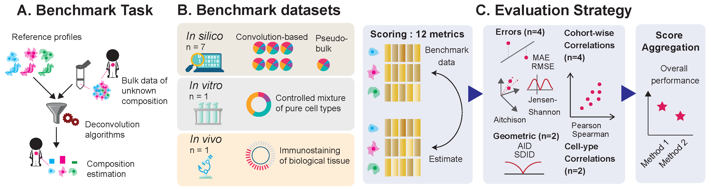

# HADACA3 Framework

> **Modular Nextflow pipeline for multi-omic deconvolution benchmarking**



This repository contains the benchmarking framework used in the **HADACA3 benchmark** study:

> *On the Promises and Limits of Multimodal Integration for Deconvolution: The HADACA3 Benchmark* 

> ⚠️ **This paper is currently under anonymous review. The preprint and full citation will be made available upon completion of the review process.**

---

## Overview

HADACA3 is a community-driven benchmark evaluating **multi-omic integration strategies for bulk tissue deconvolution**. Given bulk RNA-seq and DNA methylation (DNAm) profiles of tumor samples, the task is to estimate the relative proportions of cell types present in the mixture.

This framework provides a **modular Nextflow pipeline** that systematically evaluates all compatible combinations of:

- **Preprocessing** methods 
- **Feature selection** methods 
- **Deconvolution** algorithms 
- **Multi-omics integration** strategies 

Over **270,000 pipeline combinations** were evaluated across **9 benchmark datasets** spanning *in silico*, *in vitro*, and *in vivo* settings.

---

## Repository Structure

```
hadaca3_framework/
├── .github/workflows/              # CI/CD configuration (GitHub Actions)
├── 00_paper_reproducibility/       # Code to reproduce all paper results and figures
├── function_blocks/                # Implementation of all pipeline module functions (R/Python)
├── function_metadata_and_selection/# YAML declarations and method selection logic
├── scripts_bash/                   # Bash scripts for job submission and pipeline execution
├── utils/                          # Shared utilities (HDF5 I/O, scoring, data processing)
├── wrapper/                        # Nextflow process wrappers
├── 00_run_pipeline.nf              # Main Nextflow pipeline entry point
├── nextflow.config                 # Nextflow configuration (CPU limits, parallelism)
├── index.html                      # Pipeline results viewer
├── .gitignore
└── LICENSE                         # GPL-3.0
```

---

## Quick Start

### 1. Clone the repository

```bash
# Repository URL will be provided upon completion of the review process.
git clone <repository_url>
cd hadaca3_framework
```

### 2. Set up the environment

```bash
conda create -y -n hadaca3framework_env
conda activate hadaca3framework_env

conda install -y -c bioconda -c conda-forge -c r \
    snakemake python r-base r-rmarkdown r-nnls r-seurat \
    bioconductor-rhdf5 bioconductor-mixOmics bioconductor-edgeR \
    r-quadprog r-coda.base r-dt bioconductor-toast \
    psutil nextflow=24.10.5 r-lubridate r-remotes r-markdown \
    bioconductor-OmnipathR r-EPIC r-furrr \
    bioconda::r-mixkernel bioconda::bioconductor-mofa2 \
    bioconductor-omicade4 bioconda::mofapy2 \
    r-caret r-factominer scanpy=1.11 numpy=1.26.4

pip install uniport
Rscript -e 'install.packages("FARDEEP", repos = "http://cran.us.r-project.org", dependencies = TRUE, INSTALL_opts = "--no-lock")'
Rscript -e 'remotes::install_github("immunogenomics/presto")'
Rscript -e 'remotes::install_github("Danko-Lab/BayesPrism/BayesPrism")'
Rscript -e 'remotes::install_github("humengying0907/InstaPrism")'
Rscript -e 'remotes::install_github("xuranw/MuSiC", dependencies = TRUE,INSTALL_opts = "--no-lock")'

```

### 3. Download the data

> ⚠️ **The datasets are archived on Zenodo. The DOI and download URL will be provided upon completion of the review process.**

Once available, download and place the `.h5` files in the `data/` folder:

```bash
mkdir -p ~/projects/hadaca3_framework/data
cd ~/projects/hadaca3_framework/data

# Download from Zenodo (URL available after review)

# wget <zenodo_url>/ref.h5
# wget <zenodo_url>/groundtruth1_<dataset>_pdac.h5
# wget <zenodo_url>/mixes1_<dataset>_pdac.h5
# ...
```

The following files are expected:

| File pattern | Description |
|---|---|
| `ref.h5` | Reference profiles (RNA, DNAm, scRNA) |
| `groundtruth{1,2}_insilico*_pdac.h5` | Ground truth for in silico datasets |
| `groundtruth{1,2}_invitro_pdac.h5` | Ground truth for in vitro dataset |
| `groundtruth{1,2}_invivo_pdac.h5` | Ground truth for in vivo dataset |
| `mixes{1,2}_insilico*_pdac.h5` | Mixture data for in silico datasets |
| `mixes{1,2}_invitro_pdac.h5` | Mixture data for in vitro dataset |
| `mixes{1,2}_invivo_pdac.h5` | Mixture data for in vivo dataset |

### 4. Run the pipeline

```bash
# Basic run
nextflow run 00_run_pipeline.nf

# Resume interrupted run (dry-run)
nextflow run 00_run_pipeline.nf -stub -resume

# Full run with reports
nextflow run 00_run_pipeline.nf -with-dag -with-report -with-trace -with-timeline

# Run with a specific benchmark setup
nextflow run 00_run_pipeline.nf -resume --setup_folder benchmark/setup/1/
```

### 5. Run the meta-analysis

```bash
# Download precomputed results (optional, to skip the full pipeline)
# URLs will be provided upon completion of the review process.
# wget <zenodo_url>/results_ei.csv.gz
# wget <zenodo_url>/results_li.csv.gz

```

---

## Pipeline Architecture

The pipeline is decomposed into **four sequential modules**. Each module is independently configurable via its corresponding `.yml` file.

```
Bulk RNA + DNAm data
        │
        ▼
┌─────────────────┐
│  Preprocessing  │  ← function_metadata_and_selection/template_complete_run/preprocessing.yml
└────────┬────────┘
         │
         ▼
┌─────────────────┐
│Feature Selection│  ← function_metadata_and_selection/template_complete_run/feature_selection.yml
└────────┬────────┘
         │
    ┌────┴────┐
    │         │
    ▼         ▼
[Pipeline A]  [Pipeline B]
Late integr.  Early integr. function_metadata_and_selection/template_complete_run/early_integration.yml
    │         │
    ▼         ▼
Deconvolution (per modality or joint) function_metadata_and_selection/template_complete_run/ceconvolution.yml
    │
    ▼
Integration  ← function_metadata_and_selection/template_complete_run/late_integration.yml 
    │
    ▼
Cell-type proportion estimates
```

**Pipeline A (late integration):** deconvolve each modality independently, then combine predictions.

**Pipeline B (early integration):** combine modalities at the feature level, then deconvolve the joint representation.

---

## Adding a New Method

The framework is designed to be **extensible**. To add a new method:

### 1. Declare it in the appropriate `.yml` file

```yaml
my_method:
  path: preprocessing/my_method.R
  short_name: mymth
  omic: [mixRNA, RNA]
```

Fields:
- `path`: relative path from the repo root
- `short_name`: 4–5 character label used in plots
- `omic`: list of omic types this function handles (`mixRNA`, `mixMET`, `RNA`, `MET`, `scRNA`, or `ANY`)

Optional fields:
- `dependency`: list of external files needed at runtime
- `create`: declares that this function creates a new omic type
- `need` / `omic_need`: declares a dependency on a previously created omic type

### 2. Implement the function

Functions are declared in the `function_blocks`.

All functions within a given function type share the same signature:

```r
program_block_PP <- function(data, path_og_dataset='', omic='') { #PP stands for preprocessing
    # data: single omic matrix (features × samples)
    # path_og_dataset: list with paths to mix and reference data
    # omic: string identifying the current omic type
    ...
    return(data)
}
```

Each function is invoked through a wrapper responsible for data handling.

> **Tip:** Use the identity function (e.g., `ppID`) as a template. It returns data unchanged and serves as the no-op baseline.

**Python** is supported for early integration functions. Contributions to extend Python support to other modules are welcome.

---

## Data Format

All datasets are stored in **HDF5 format** (`.h5`). The framework provides read/write utilities in `utils/data_processing.R` and `utils/data_processing.py`.

Key functions:

| Function | Description |
|----------|-------------|
| `read_hdf5(path)` | Read all sub-datasets from a path |
| `write_global_hdf5(path, data_list)` | Write all sub-datasets |

All HDF5 files use gzip compression (level 6) with shuffling for reduced storage footprint. Files can be explored interactively at [h5web.panosc.eu](https://h5web.panosc.eu/) or H5Web VS Code extension  or the command-line tool `h5dump` the linux command H5dump. 

---

## Continuous Integration

Two CI pipelines are configured:

| CI type | Trigger | Description |
|---------|---------|-------------|
| **Partial** | Every commit | Resumes incomplete tasks (`-resume`) |
| **Full** | Daily at 3am (if modified) | Re-runs all tasks from scratch to verify reproducibility |

To skip CI on a commit, include one of the following keywords in the commit message: `[skip ci]`, `[ci skip]`, `[no ci]`, `[skip actions]`, `[actions skip]`.
The incremental CI pipeline resumes execution by reading the selected functions from `function_metadata_and_selection/CI_functions_selection`

---

## License

This project is licensed under the **GNU General Public License v3.0**. See [LICENSE](LICENSE) for details.

---

## Citation

> ⚠️ Citation information will be provided upon completion of the review process.

---

## Contributing

Contributions are welcome! To add a new deconvolution method, integration strategy, or feature selection approach, please follow the instructions in the [Adding a New Method](#adding-a-new-method) section and open a pull request.

For bug reports or feature requests, please open an issue on the repository (link available after review).
